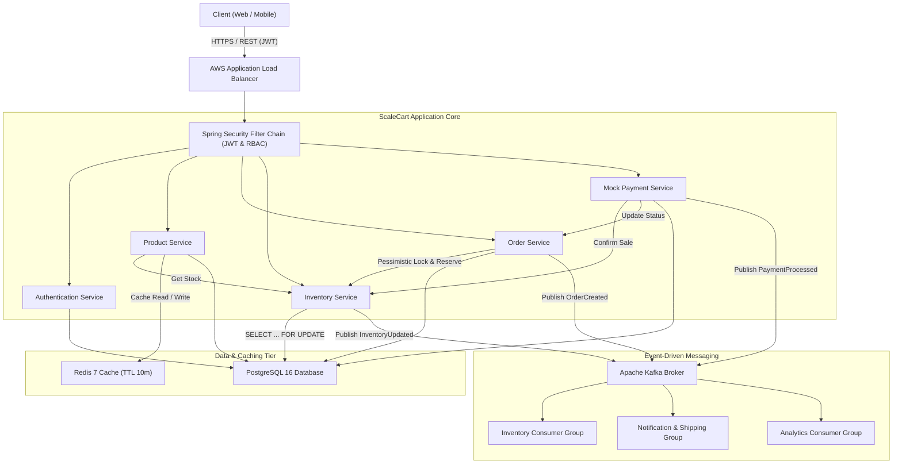
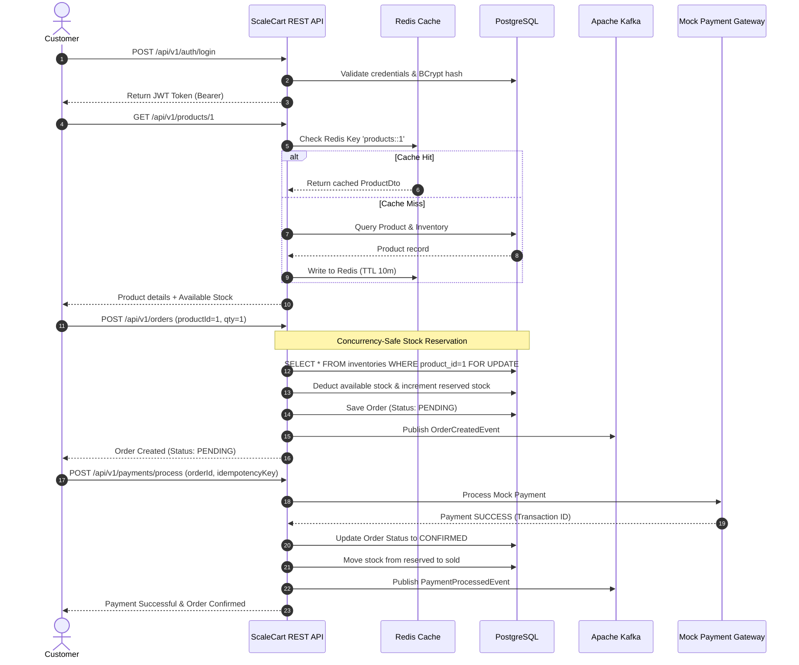

# ScaleCart — Scalable E-Commerce Backend System

[](https://www.oracle.com/java/)
[](https://spring.io/projects/spring-boot)
[](https://spring.io/projects/spring-security)
[](https://www.postgresql.org/)
[](https://redis.io/)
[-black.svg)](https://kafka.apache.org/)
[](https://www.docker.com/)
[-FF9900.svg)](https://aws.amazon.com/)
[](https://www.jenkins.io/)

---

## 🎯 Executive Overview

**ScaleCart** is an enterprise-grade, production-style backend system engineered for a scalable e-commerce platform. It handles authentication, product catalogs, order workflows, high-concurrency inventory locking, mock payment processing, and asynchronous event streaming.

Built with **Java 21** and **Spring Boot 3.3**, ScaleCart strictly adheres to **Clean Architecture**, **Domain-Driven Design (DDD)**, and **SOLID principles**, designed specifically to demonstrate the capabilities required for a modern Backend Software Engineer.

---

## 💼 Skills Mapping Matrix (Job Description Alignment)

| JD Requirement | ScaleCart Implementation | Code Reference |
| :--- | :--- | :--- |
| **Java & Spring Frameworks** | Spring Boot 3.3, Spring Data JPA, Spring Security 6, Spring Kafka, Spring Cache | [`pom.xml`](pom.xml) |
| **Effective, Scalable Code** | Modular architecture, DTO pattern, separation of concerns, connection pooling | [`ScaleCartApplication.java`](src/main/java/com/scalecart/ScaleCartApplication.java) |
| **RDBMS (PostgreSQL)** | PostgreSQL 16 schema, HikariCP, indexes, JPA entity mappings | [`application-postgres.yml`](src/main/resources/application-postgres.yml) |
| **REST API Development** | Versioned RESTful endpoints (`/api/v1/`), standard response envelope, Swagger 3 UI | [`ProductController.java`](src/main/java/com/scalecart/product/controller/ProductController.java) |
| **Security & Data Protection** | Stateless Spring Security 6, JWT (HMAC-SHA256), BCrypt hashing, Role-Based Access Control | [`SecurityConfig.java`](src/main/java/com/scalecart/config/SecurityConfig.java) |
| **Concurrency & Problem-Solving** | Database-level Pessimistic Locking (`SELECT ... FOR UPDATE`) preventing overselling | [`InventoryRepository.java`](src/main/java/com/scalecart/inventory/repository/InventoryRepository.java) |
| **Caching & Performance Tuning** | Redis Cache-Aside pattern with TTL, JSON serialization, and graceful degradation fallback | [`RedisConfig.java`](src/main/java/com/scalecart/config/RedisConfig.java) |
| **Event-Driven Microservices** | Apache Kafka event streaming (`OrderCreated`, `PaymentProcessed`, `InventoryUpdated`) | [`KafkaConfig.java`](src/main/java/com/scalecart/config/KafkaConfig.java) |
| **CI / CD (Jenkins & GitHub Actions)** | Declarative `Jenkinsfile` (Test, Sonar, Docker, Deploy) + GitHub Actions CI workflow | [`Jenkinsfile`](Jenkinsfile) & [`.github/workflows/ci.yml`](.github/workflows/ci.yml) |
| **Cloud Architecture (AWS)** | Complete AWS Terraform blueprints (ECS Fargate, RDS Multi-AZ, ElastiCache, MSK, ALB) | [`aws/terraform/main.tf`](aws/terraform/main.tf) |
| **Testing & Quality Assurance** | JUnit 5, Mockito, Spring Boot Test, multithreaded concurrency tests | [`InventoryConcurrencyTest.java`](src/test/java/com/scalecart/inventory/InventoryConcurrencyTest.java) |

---

## 🏗️ High-Level System Architecture



---

## 🔄 End-to-End Workflow



---

## 💡 Technical Architecture Deep Dives

### 1. High-Concurrency Stock Reservation: Preventing Race Conditions and Overselling

> **Scenario**: Two users attempt to buy the last remaining unit of an item (`availableStock = 1`) at the exact same millisecond.

#### The Problem:
In standard unsynchronized systems:
1. Thread A queries database: `availableStock = 1`.
2. Thread B queries database concurrently: `availableStock = 1`.
3. Thread A checks `1 >= 1` (OK), updates `availableStock = 0`.
4. Thread B checks `1 >= 1` (OK), updates `availableStock = -1` (or 0).
5. **Outcome**: Both orders succeed, but the merchant only had 1 unit in physical stock. **This is a classic race condition resulting in overselling.**

#### The ScaleCart Solution:
ScaleCart implements **Pessimistic Write Locking** at the database engine level via JPA:

```java
@Lock(LockModeType.PESSIMISTIC_WRITE)
@Query("SELECT i FROM Inventory i WHERE i.product.id = :productId")
Optional<Inventory> findByProductIdWithLock(@Param("productId") Long productId);
```

- When Thread A requests the row, PostgreSQL executes:
  ```sql
  SELECT * FROM inventories WHERE product_id = ? FOR UPDATE;
  ```
- **Thread B is blocked by the database engine** until Thread A's transaction commits or rolls back.
- When Thread B acquires the lock, it immediately reads the updated row where `availableStock = 0`.
- The validation check fails, and ScaleCart immediately throws:
  ```java
  throw new InsufficientStockException("Insufficient stock for product ID: ...");
  ```
- **Outcome**: Exactly 1 order succeeds, and competing requests receive an `HTTP 409 Conflict`. Zero race conditions. Zero negative stock.

> **Automated Verification**: See [`InventoryConcurrencyTest.java`](src/test/java/com/scalecart/inventory/InventoryConcurrencyTest.java) where an `ExecutorService` launches concurrent threads simultaneously firing at `stock = 1`. The test asserts that exactly 1 succeeds and 1 fails.

---

### 2. Redis Caching & Cache-Aside Architecture

ScaleCart uses Redis to accelerate catalog browsing:
- **Cache-Aside Pattern**: `GET /api/v1/products/{id}` checks Redis first. On cache miss, it reads from PostgreSQL, updates Redis with a 10-minute TTL, and returns the response.
- **Cache Invalidation**: When an admin updates a product or replenishes stock, `@CacheEvict(value = "products", allEntries = true)` purges stale entries to prevent dirty reads.
- **Resilient Cache Degradation**: If Redis experiences a network partition or is temporarily down, the custom `CacheErrorHandler` in [`RedisConfig.java`](src/main/java/com/scalecart/config/RedisConfig.java) intercepts the exception, logs a warning, and seamlessly falls back to the database without returning a 500 error to the client.

---

### 3. Payment Processing & Idempotency

Network timeouts often cause customers or payment gateways to retry requests:
- ScaleCart's `PaymentService` enforces **Idempotency Keys**:
  ```java
  Optional<Payment> existing = paymentRepository.findByIdempotencyKey(request.getIdempotencyKey());
  if (existing.isPresent()) {
      return mapToDto(existing.get()); // Return existing transaction, no double-charge
  }
  ```
- This guarantees **exactly-once billing semantics** even in flaky network conditions.

---

### 4. Event-Driven Architecture with Apache Kafka

- **Decoupled Services**: Order placement does not synchronously depend on external invoicing, notification, or analytics systems.
- **Topics**:
  - `order-created-events`: Broadcasts new orders with partition key `orderId`.
  - `payment-processed-events`: Broadcasts payment confirmations.
  - `inventory-updated-events`: Broadcasts stock level transitions.
- **Graceful Fallback**: If Kafka is not running (e.g. lightweight local dev), the built-in `EventPublisher` detects the configuration and publishes to Spring's in-process `ApplicationEventPublisher`, ensuring 100% functionality everywhere.

---

## 🚀 Getting Started

### Prerequisites
- **Java 21** or higher
- Optional: **Docker** & **Docker Compose** (for PostgreSQL, Redis, Kafka containers)

---

### Mode 1: Quick Local Run (Zero External Dependencies)
ScaleCart includes an in-memory profile with embedded H2 database, in-memory caching, and in-memory event bus. It boots in under 3 seconds!

```bash
# Clone the repository
git clone https://github.com/deepanshiantil2505/ScaleCart-E-Commerce-Backend-Project.git
cd ScaleCart-E-Commerce-Backend-Project

# Run unit and concurrency tests
./mvnw clean test

# Start the Spring Boot application
./mvnw spring-boot:run
```

Once started:
- **Swagger 3 Interactive UI**: [http://localhost:8080/swagger-ui.html](http://localhost:8080/swagger-ui.html)
- **OpenAPI JSON Spec**: [http://localhost:8080/v3/api-docs](http://localhost:8080/v3/api-docs)
- **H2 Web Console**: [http://localhost:8080/h2-console](http://localhost:8080/h2-console) (JDBC URL: `jdbc:h2:mem:scalecartdb`, User: `sa`, Password: empty)

---

### Mode 2: Full Production Stack via Docker Compose
Launches Spring Boot + PostgreSQL 16 + Redis 7 + Apache Kafka KRaft + Kafka-UI:

```bash
docker compose up --build -d
```

Services exposed:
- **ScaleCart REST API**: `http://localhost:8080`
- **Swagger UI**: `http://localhost:8080/swagger-ui.html`
- **PostgreSQL Database**: `localhost:5432` (`scalecart_db` / `scalecart_user` / `scalecart_password`)
- **Redis Cache**: `localhost:6379`
- **Apache Kafka**: `localhost:9092`
- **Kafka-UI (Topic Explorer)**: `http://localhost:8085`

---

## 🔑 Pre-Seeded Default Accounts

| Role | Email | Password | Permissions |
| :--- | :--- | :--- | :--- |
| **Admin** | `admin@scalecart.com` | `Admin@123` | Create/update/delete products, replenish inventory, view all users/orders |
| **Customer** | `customer@scalecart.com` | `Customer@123` | Browse catalog, place orders, cancel own orders, make payments |

---

## 🧪 Automated Testing & Verification

Run the entire test suite (including unit tests, Mockito mocks, and multithreaded concurrency tests):

```bash
./mvnw clean test
```

### Running the End-to-End API Test Script
When the application is running, run the included PowerShell test script:

```powershell
.\test-api.ps1
```
This script automatically executes:
1. Customer authentication & JWT acquisition
2. Product catalog retrieval & Redis cache verification
3. Order creation with pessimistic stock reservation
4. Idempotent payment processing
5. Order state confirmation verification
6. Stock transition check in inventory

---

## 📡 API Endpoints Catalog

### 1. Authentication (`/api/v1/auth`)
- `POST /api/v1/auth/register` — Register a customer or admin account
- `POST /api/v1/auth/login` — Authenticate and receive JWT token

### 2. Products & Categories (`/api/v1/products`, `/api/v1/categories`)
- `GET /api/v1/products` — Browse products (supports `?search=keyword` & `?categoryId=1`)
- `GET /api/v1/products/{id}` — Get single product (Redis Cache-Aside)
- `POST /api/v1/products` — Create product with initial inventory *(Admin Only)*
- `PUT /api/v1/products/{id}` — Update product & evict cache *(Admin Only)*
- `DELETE /api/v1/products/{id}` — Soft delete product *(Admin Only)*
- `GET /api/v1/categories` — List all product categories

### 3. Inventory Management (`/api/v1/inventory`)
- `GET /api/v1/inventory/product/{productId}` — View available, reserved, and sold stock
- `POST /api/v1/inventory/replenish` — Add new stock units *(Admin Only)*

### 4. Orders (`/api/v1/orders`)
- `POST /api/v1/orders` — Place new order (reserves inventory under row-level lock)
- `GET /api/v1/orders` — View order history (customer) or all orders (admin)
- `GET /api/v1/orders/{id}` — Get order details
- `POST /api/v1/orders/{id}/cancel` — Cancel order & release stock back to available

### 5. Payments (`/api/v1/payments`)
- `POST /api/v1/payments/process` — Process payment (idempotency key, mock card/UPI, simulation flag)
- `GET /api/v1/payments/order/{orderId}` — View transaction records for an order

---

## ☁️ Cloud & DevOps Infrastructure

### AWS Cloud Architecture (Terraform)
Located in [`aws/terraform/`](aws/terraform/):
- **VPC & Subnets**: Multi-AZ public & private subnets with NAT Gateway.
- **Amazon ECS (Fargate)**: Serverless container deployment for Spring Boot.
- **Application Load Balancer (ALB)**: SSL/TLS termination and path routing.
- **Amazon RDS PostgreSQL (Multi-AZ)**: High-availability relational database.
- **Amazon ElastiCache for Redis**: Distributed caching cluster.
- **Amazon MSK (Managed Streaming for Kafka)**: Enterprise event streaming.

### CI/CD Pipeline (Jenkins)
Located in [`Jenkinsfile`](Jenkinsfile):
1. **Checkout**: Pull latest code from Git.
2. **Compile & Unit Test**: Execute Maven test suite.
3. **SonarQube Quality Gate**: Static code analysis and code coverage checks.
4. **Package**: Build executable JAR.
5. **Docker Build & Vulnerability Scan**: Build image and scan via Trivy.
6. **Publish**: Push to Amazon ECR.
7. **Deploy**: Update ECS Fargate service with zero-downtime rolling deployment.

---

## 📁 Project Directory Structure

```text
scalecart/
├── .github/workflows/ci.yml       # GitHub Actions CI pipeline
├── aws/terraform/                 # Production AWS Terraform Infrastructure
│   ├── main.tf                    # VPC, ECS, RDS, Redis, ALB definitions
│   ├── variables.tf               # Terraform input variables
│   └── outputs.tf                 # Cloud endpoints output
├── src/
│   ├── main/
│   │   ├── java/com/scalecart/
│   │   │   ├── ScaleCartApplication.java
│   │   │   ├── common/            # ApiResponse, GlobalExceptionHandler, Exceptions
│   │   │   ├── config/            # SecurityConfig, JwtProvider, RedisConfig, KafkaConfig, OpenApiConfig
│   │   │   ├── event/             # EventPublisher, KafkaConsumers, LocalConsumer, Event Models
│   │   │   ├── inventory/         # Inventory entity, Pessimistic Locking Repository, Service, Controller
│   │   │   ├── order/             # Order & OrderItem entities, OrderService, Controller, DTOs
│   │   │   ├── payment/           # Payment entity, Mock Payment Service, Controller, DTOs
│   │   │   ├── product/           # Product & Category entities, Redis Caching Service, Controller, DTOs
│   │   │   ├── seeder/            # CommandLineRunner data seeder for users and products
│   │   │   └── user/              # User entity, Spring Security UserDetails, AuthService, Controller
│   │   └── resources/
│   │       ├── application.yml            # Default dev profile (H2, in-memory cache)
│   │       ├── application-postgres.yml   # Production profile (PostgreSQL, Redis, Kafka)
│   │       └── application-test.yml       # Test profile
│   └── test/java/com/scalecart/   # Comprehensive JUnit 5 & Concurrency Tests
│       ├── inventory/InventoryConcurrencyTest.java
│       ├── order/OrderServiceTest.java
│       ├── payment/PaymentServiceTest.java
│       ├── product/ProductServiceTest.java
│       └── user/UserServiceTest.java
├── Dockerfile                     # Multi-stage production container build
├── docker-compose.yml             # Orchestration for App, PostgreSQL, Redis, Kafka, Kafka-UI
├── Jenkinsfile                    # Declarative Jenkins CI/CD pipeline
├── ScaleCart.postman_collection.json # Postman collection for API exploration
├── test-api.ps1                   # Automated PowerShell API test script
└── pom.xml                        # Maven dependencies & build configuration
```

---

## 📜 License
Distributed under the Apache 2.0 License. Built by Deepanshi Antil.
